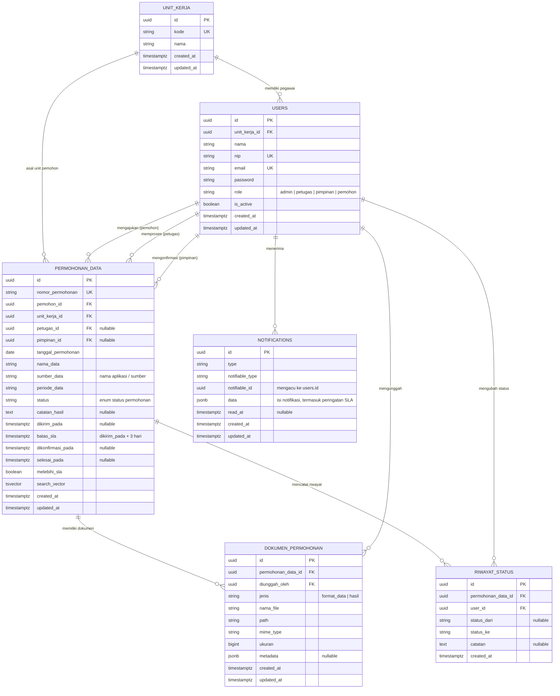

# Product Requirements Document (PRD)
## Sistem Informasi Permohonan Pengolahan Data BAPETEN

| | |
|--|--|
| **Nama Sistem** | Sistem Informasi Permohonan Pengolahan Data BAPETEN |
| **Tanggal** | 23 September 2026 |
| **Penyusun** | Robby Rehantoro — Pranata Komputer Ahli Pertama |
| **Instansi** | Badan Pengawas Tenaga Nuklir (BAPETEN) |

---

## Ringkasan Sistem

> *Jelaskan dalam 2–4 kalimat: apa sistemnya, untuk siapa, dan manfaat utamanya.*

Badan Pengawas Tenaga Nuklir (BAPETEN) membutuhkan sistem online terpadu untuk mengelola layanan **pengolahan data**, yaitu permintaan data yang belum dapat dihasilkan oleh aplikasi yang ada. Sistem ini memudahkan pegawai BAPETEN mengajukan permohonan kepada Pusat Data secara online, membantu petugas Pusat Data memproses dan menindaklanjuti permohonan, serta memberikan pimpinan kemampuan konfirmasi hasil, dashboard, dan laporan. Target: setiap permohonan pengolahan data diselesaikan dalam **maksimal 3 hari (SLA)**, dengan notifikasi otomatis jika melebihi batas waktu.

---

## Arsitektur & Teknologi

### Stack Teknologi

| Komponen | Teknologi | Versi | Keterangan |
|----------|-----------|-------|------------|
| **Bahasa** | PHP | ≥ 8.3 | Versi minimum yang didukung Laravel 13 |
| **Framework** | [Laravel](https://laravel.com/) | v13 | Full-stack PHP framework |
| **Admin Panel** | [Filament](https://filamentphp.com/) | v5 | UI framework berbasis TALL Stack (Tailwind CSS, Alpine.js, Livewire, Laravel) |
| **Database** | PostgreSQL | ≥ 16 | RDBMS utama untuk seluruh data aplikasi |
| **Frontend** | TALL Stack | — | Tailwind CSS + Alpine.js + Livewire (bawaan Filament) |

### Arsitektur Database — PostgreSQL

> *Gunakan PostgreSQL sebagai satu-satunya RDBMS. Manfaatkan fitur-fitur native PostgreSQL berikut sesuai kebutuhan:*

| Fitur PostgreSQL | Kegunaan dalam Sistem |
|------------------|-----------------------|
| **UUID** (`uuid` / `ulid`) | Primary key yang aman untuk entitas publik (permohonan, dokumen hasil) |
| **JSONB** | Menyimpan data dinamis/metadata fleksibel (contoh: metadata dokumen format data) |
| **Full-Text Search** (`tsvector`) | Pencarian cepat pada data permohonan (nama data, sumber data/aplikasi, pemohon) |
| **Enum Types** | Status permohonan (`draft`, `diajukan`, `diproses`, `menunggu_konfirmasi`, `selesai`) |
| **Partial Index** | Index kondisional, contoh: permohonan yang belum selesai untuk pemantauan SLA |
| **Foreign Key Constraints** | Integritas referensial antar tabel |
| **Timestamp with Time Zone** | Konsistensi waktu dan perhitungan SLA lintas zona waktu |

### Struktur Panel Filament v5

> *Filament v5 mendukung multi-panel. Definisikan panel sesuai peran pengguna.*

| Panel | Path | Peran Pengguna | Deskripsi |
|-------|------|----------------|-----------|
| **Admin** | `/admin` | Admin, Petugas | Kelola seluruh data, manajemen pengguna, input tindak lanjut permohonan, upload dokumen hasil |
| **Pimpinan** | `/pimpinan` | Pimpinan (Kepala Pusat Data) | Konfirmasi tindak lanjut petugas, dashboard, dan laporan |
| **Portal Pemohon** | `/portal` | Pemohon (Pegawai BAPETEN) | Membuat dan mengirim permohonan, upload dokumen, cek status, mengakses hasil |

### Komponen Filament v5 yang Digunakan

| Komponen | Fungsi |
|----------|--------|
| **Resources** | CRUD untuk entitas utama (Permohonan Data, Dokumen Format Data, Pengguna) |
| **Relation Managers** | Mengelola relasi (contoh: Dokumen Format Data dalam Permohonan) |
| **Dashboard Widgets** | Stat widgets dan chart widgets untuk metrik dan tren permohonan |
| **Actions & Modals** | Konfirmasi aksi, form input dalam modal (contoh: kirim permohonan, kirim ke pimpinan, konfirmasi hasil) |
| **Notifications** | Notifikasi in-app untuk perubahan status dan peringatan SLA |
| **Tables** | Tabel data dengan filter, sort, search, dan bulk actions |
| **Forms** | Form builder dengan validasi, conditional fields, dan file upload (multiple) |
| **Infolists** | Tampilan detail read-only untuk halaman informasi permohonan |
| **Custom Pages** | Halaman khusus (contoh: cetak laporan rekap) |

---

## 1. Pengguna Sistem

| Peran | Siapa | Yang Mereka Lakukan | Panel Filament |
|-------|-------|---------------------|----------------|
| **Admin** | Staf TI | Mengatur semua data dan hak akses pengguna lain | Admin |
| **Petugas** | Staf Pusat Data | Input tindak lanjut permohonan, upload dokumen, konfirmasi | Admin |
| **Pimpinan** | Kepala Pusat Data | Konfirmasi tindak lanjut petugas, melihat dashboard dan laporan | Pimpinan |
| **Pemohon** | Pegawai BAPETEN | Mendaftarkan permohonan, upload dokumen, cek status | Portal Pemohon |

---

## 2. Layanan yang Dikelola Sistem

> *Untuk setiap layanan: jelaskan alurnya dan data apa yang perlu dicatat.*
> *Aturan bisnis penting wajib dituliskan — ini yang akan menjadi validasi di sistem.*

---

### Layanan 1 — Permohonan Data

**Deskripsi:** Layanan pengolahan data bagi pegawai BAPETEN untuk data yang belum dapat dihasilkan oleh aplikasi yang tersedia. Pemohon mengajukan permohonan kepada Pusat Data BAPETEN, petugas memproses dan menginput hasilnya, pimpinan mengonfirmasi, lalu hasilnya dapat diakses pemohon.

**Alur:**
1. Pemohon menginput permohonan data
2. Pemohon mengirim permohonan ke Pusat Data untuk diproses
3. Petugas data menerima permohonan dan memproses permohonan
4. Petugas menginput hasil permohonan data
5. Petugas mengirim permohonan data ke Pimpinan
6. Pimpinan mengonfirmasi hasil permohonan data
7. Permohonan data selesai dan hasilnya dapat diakses pemohon

**Data yang dicatat:** nama pemohon · unit kerja · tanggal permohonan · nama data · sumber data/nama aplikasi · periode data · dokumen format data (multiple)

**Aturan bisnis:**
- SLA permohonan **maksimal 3 hari**
- Jika melebihi SLA, sistem mengirim **notifikasi ke petugas dan pimpinan**

---

## 3. Laporan & Dashboard yang Dibutuhkan

### Dashboard Utama (tampil saat login)

| Informasi | Keterangan |
|-----------|------------|
| Total Permohonan Masuk | Jumlah seluruh permohonan yang masuk |
| Total Permohonan Proses | Jumlah permohonan yang sedang diproses |
| Total Permohonan Selesai | Jumlah permohonan yang telah selesai |
| Total Permohonan Melebihi SLA | Jumlah permohonan yang melewati batas SLA 3 hari |

### Laporan Berkala

| Laporan | Frekuensi | Isi | Format |
|---------|-----------|-----|--------|
| Rekap Permohonan | Bulanan | Rekapitulasi permohonan pengolahan data | Excel & PDF |
| Statistik Permohonan | Triwulanan | Statistik permohonan per triwulan | Excel & PDF |

---

## 4. Rancangan Database (ERD)

> *Diagram relasi antar tabel untuk PostgreSQL. Nama tabel dan kolom memakai `snake_case` sesuai konvensi Laravel.*

### Keterangan Relasi

| Relasi | Keterangan |
|--------|------------|
| `unit_kerja` → `users` | Satu unit kerja memiliki banyak pegawai |
| `users` → `permohonan_data` | Satu pengguna (pemohon) dapat mengajukan banyak permohonan; petugas dan pimpinan juga terhubung ke permohonan melalui `petugas_id` dan `pimpinan_id` |
| `permohonan_data` → `dokumen_permohonan` | Satu permohonan memiliki banyak dokumen (multiple): `format_data` diunggah pemohon, `hasil` diunggah petugas |
| `permohonan_data` → `riwayat_status` | Setiap perubahan status dicatat sebagai jejak audit alur permohonan |
| `users` → `notifications` | Notifikasi in-app, termasuk peringatan saat permohonan melebihi SLA ke petugas dan pimpinan |

### Status Permohonan (Enum)

| Status | Sesuai Langkah Alur |
|--------|---------------------|
| `draft` | Pemohon menginput permohonan data |
| `diajukan` | Pemohon mengirim permohonan ke Pusat Data |
| `diproses` | Petugas menerima dan memproses permohonan, serta menginput hasil |
| `menunggu_konfirmasi` | Petugas mengirim permohonan data ke Pimpinan |
| `selesai` | Pimpinan mengonfirmasi; hasil dapat diakses pemohon |

### Catatan Implementasi Database

- `batas_sla` dihitung otomatis saat status berubah menjadi `diajukan` (`dikirim_pada` + 3 hari); `melebihi_sla` diperbarui oleh scheduled command Laravel yang juga memicu notifikasi ke petugas dan pimpinan.
- Partial index pada `status` untuk permohonan yang belum `selesai` agar pemantauan SLA dan dashboard cepat.
- `search_vector` (`tsvector`) dengan GIN index untuk pencarian pada `nama_data`, `sumber_data`, dan `nomor_permohonan`.
- Tabel `notifications` mengikuti struktur bawaan Laravel (`php artisan make:notifications-table`), disesuaikan agar `notifiable_id` bertipe UUID.

---

> **Catatan untuk AI Coding Assistant:**
>
> **Stack & Arsitektur:**
> - Framework: **Laravel 13** dengan **Filament v5** (TALL Stack)
> - Database: **PostgreSQL ≥ 16** — gunakan migration Laravel dengan driver `pgsql`
> - Gunakan **UUID/ULID** sebagai primary key untuk entitas yang diekspos ke publik
> - Gunakan fitur **JSONB** PostgreSQL untuk metadata dinamis via Laravel `$casts`
> - Gunakan **Enum type** PostgreSQL untuk kolom status (atau string enum yang dicasting di Model)
>
> **Mapping PRD → Kode:**
> - Setiap **layanan** di Bagian 2 → 1 modul Filament Resource + set tabel database (migration PostgreSQL)
> - Setiap **alur** → urutan status pada kolom `status` (enum) di tabel transaksi
> - Setiap **data yang dicatat** → kolom-kolom pada migration + `$fillable` di Eloquent Model
> - Setiap **aturan bisnis** → validasi di Form schema Filament + business logic di Model/Action class (termasuk perhitungan SLA dan notifikasi)
> - Setiap **peran pengguna** → Panel Filament terpisah dengan middleware auth + policy authorization
> - Bagian 3 → `StatsOverviewWidget`, `ChartWidget` di dashboard Filament + fitur ekspor PDF/Excel
> - Bagian 4 (ERD) → acuan migration PostgreSQL, relasi Eloquent (`belongsTo`/`hasMany`), dan Relation Manager Filament untuk `dokumen_permohonan` dan `riwayat_status`
>
> **Referensi:**
> - Dokumentasi Filament v5: https://filamentphp.com/docs
> - Dokumentasi Laravel: https://laravel.com/docs
> - Dokumentasi PostgreSQL: https://www.postgresql.org/docs/

---
