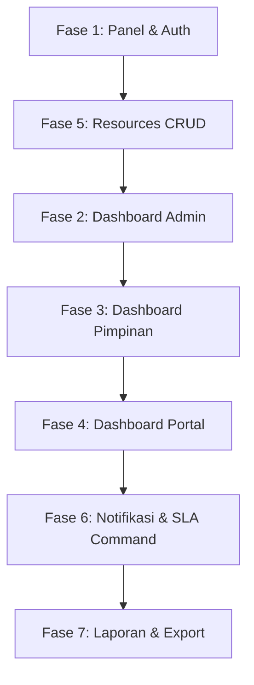

# Rencana Aksi — Dashboard Filament v5
## Sistem Informasi Permohonan Pengolahan Data BAPETEN

> **Stack:** Laravel 13 · Filament v5.8.4 · PostgreSQL  
> **Status saat ini:** Panel Admin sudah ada (`/admin`), model-model inti sudah dibuat, Enums sudah didefinisikan. Belum ada Filament Resources, Widgets, atau panel Pimpinan/Portal.

---

## Gambaran Umum Panel

| Panel | Path | Peran | Provider |
|-------|------|-------|----------|
| **Admin** | `/admin` | Admin, Petugas | `AdminPanelProvider` ✅ (sudah ada) |
| **Pimpinan** | `/pimpinan` | Pimpinan | `PimpinanPanelProvider` 🔲 perlu dibuat |
| **Portal** | `/portal` | Pemohon | `PortalPanelProvider` 🔲 perlu dibuat |

---

## Fase 1 — Fondasi Panel & Autentikasi

### 1.1 Bersihkan default widgets dari Admin Panel
- Hapus `AccountWidget` dan `FilamentInfoWidget` bawaan dari `AdminPanelProvider`
- Ganti `->widgets([])` agar hanya widget custom yang muncul

### 1.2 Buat Panel Pimpinan
```bash
php artisan make:filament-panel pimpinan --no-interaction
```
- Path: `/pimpinan`
- Auth: hanya `UserRole::Pimpinan`
- Buat middleware custom `EnsureUserIsPimpinan` atau gunakan Filament policy

### 1.3 Buat Panel Portal Pemohon
```bash
php artisan make:filament-panel portal --no-interaction
```
- Path: `/portal`
- Auth: hanya `UserRole::Pemohon`

### 1.4 Konfigurasi Autentikasi per Panel
Tambahkan `->authGuard('web')` dan authorization check per panel.
Buat `App\Policies\UserPolicy` untuk gate per peran, atau gunakan method `canAccessPanel` di model `User`:

```php
// app/Models/User.php
public function canAccessPanel(Panel $panel): bool
{
    return match ($panel->getId()) {
        'admin'   => in_array($this->role, [UserRole::Admin, UserRole::Petugas]),
        'pimpinan'=> $this->role === UserRole::Pimpinan,
        'portal'  => $this->role === UserRole::Pemohon,
        default   => false,
    };
}
```

---

## Fase 2 — Dashboard Admin & Petugas (`/admin`)

### 2.1 Stat Widgets (StatsOverviewWidget)

Buat satu widget `PermohonanStatsWidget`:

```bash
php artisan make:filament-widget PermohonanStatsWidget --stats-overview --no-interaction
```

Berisi 4 stat card sesuai PRD:

| Stat | Query |
|------|-------|
| Total Permohonan Masuk | `PermohonanData::whereNotNull('dikirim_pada')->count()` |
| Sedang Diproses | `PermohonanData::whereIn('status', ['diajukan','diproses','menunggu_konfirmasi'])->count()` |
| Selesai | `PermohonanData::where('status', StatusPermohonan::Selesai)->count()` |
| Melebihi SLA | `PermohonanData::where('melebihi_sla', true)->count()` |

Tambahkan icon, warna, dan description (trend: bulan ini vs bulan lalu).

### 2.2 Chart Widget — Tren Permohonan per Bulan

```bash
php artisan make:filament-widget PermohonanTrendChart --chart --no-interaction
```

- Tipe: `LineChart` atau `BarChart`
- Data: 12 bulan terakhir, group by `DATE_TRUNC('month', dikirim_pada)`
- Dataset: total masuk vs total selesai

### 2.3 Chart Widget — Distribusi Status

```bash
php artisan make:filament-widget StatusDistribusiChart --chart --no-interaction
```

- Tipe: `DoughnutChart`
- Data: count per `status` (semua permohonan aktif)
- Warna sesuai `StatusPermohonan::getColor()`

### 2.4 Daftarkan Widgets di Admin Panel

Di `AdminPanelProvider`, widget didiscover otomatis via `->discoverWidgets()` (sudah ada). Pastikan widgets ada di `app/Filament/Widgets/`.

Atur urutan dengan `protected static ?int $sort` di masing-masing widget:
1. `PermohonanStatsWidget` (sort: 1)
2. `PermohonanTrendChart` (sort: 2)
3. `StatusDistribusiChart` (sort: 3)

---

## Fase 3 — Dashboard Pimpinan (`/pimpinan`)

### 3.1 Stat Widgets Pimpinan
- Sama seperti admin stats, tapi bisa ditambah:
  - Rata-rata waktu penyelesaian (avg `selesai_pada - dikirim_pada`)
  - Permohonan menunggu konfirmasi pimpinan (`status = menunggu_konfirmasi`)

### 3.2 Chart Widget — Statistik Triwulanan
- `BarChart` per triwulan, 4 quarter tahun berjalan
- Buat class terpisah: `StatistikTriwulanChart`

### 3.3 Tabel Permohonan Menunggu Konfirmasi
- Buat widget tabel: `PermohonanMenungguKonfirmasiWidget` (extends `TableWidget`)
- Tampilkan: nomor, pemohon, unit kerja, tanggal kirim, batas SLA
- Kolom `melebihi_sla` diberi badge merah

---

## Fase 4 — Dashboard Portal Pemohon (`/portal`)

### 4.1 Stat Widgets Pemohon
Tampilkan data milik pemohon yang login:
- Permohonan saya (total)
- Sedang diproses
- Selesai
- Melebihi SLA (milik saya)

### 4.2 Tabel Permohonan Saya
- Widget tabel dengan filter status
- Link ke detail permohonan

---

## Fase 5 — Filament Resources (CRUD)

> Dashboard perlu data; pastikan resources ini dibuat sebelum/bersamaan dashboard.

### 5.1 Resource Permohonan Data (Admin/Petugas)

```bash
php artisan make:filament-resource PermohonanData --generate --no-interaction
```

- **Table columns:** nomor_permohonan, nama_data, pemohon nama, unit kerja, status (badge), melebihi_sla (icon), batas_sla
- **Form fields:** nama_data, sumber_data, periode_data, dokumen (FileUpload, multiple)
- **Filters:** SelectFilter status, DateRangeFilter tanggal, TernaryFilter melebihi_sla
- **Actions:**
  - `KirimPermohonanAction` → ubah status ke `diajukan`, set `dikirim_pada`, hitung `batas_sla`
  - `ProsesPermohonanAction` → ubah status ke `diproses`, assign `petugas_id`
  - `KirimKePimpinanAction` → ubah status ke `menunggu_konfirmasi`
- **Relation Managers:** `DokumenPermohonanRelationManager`, `RiwayatStatusRelationManager`

### 5.2 Resource User (Admin only)

```bash
php artisan make:filament-resource User --generate --no-interaction
```

- Kolom: nama, nip, email, role (badge), unit_kerja, is_active (toggle)
- Form: semua field user + password (dengan konfirmasi)

### 5.3 Resource Unit Kerja (Admin only)

```bash
php artisan make:filament-resource UnitKerja --generate --no-interaction
```

---

## Fase 6 — Notifikasi In-App Filament

### 6.1 Integrasi Database Notifications
- Tabel `notifications` sudah ada (migration sudah dibuat)
- Enable di panel: `->databaseNotifications()` di tiap PanelProvider

### 6.2 SLA Alert Notification
Buat `App\Notifications\SlaTerminatedNotification`:
```bash
php artisan make:notification SlaTerminatedNotification --no-interaction
```
- Kirim ke petugas + pimpinan saat `melebihi_sla` = true
- Gunakan Filament `DatabaseNotification` agar muncul di bell icon

### 6.3 Scheduled Command — Cek SLA
```bash
php artisan make:command CekSlaPermohonan --no-interaction
```
- Query permohonan aktif yang `batas_sla < now()` dan `melebihi_sla = false`
- Set `melebihi_sla = true` dan kirim notifikasi
- Daftarkan di `routes/console.php`: `Schedule::command('permohonan:cek-sla')->hourly()`

---

## Fase 7 — Halaman Laporan (Custom Page)

```bash
php artisan make:filament-page LaporanRekap --no-interaction
```

- Filter: bulan/tahun atau triwulan
- Tombol export Excel (gunakan `maatwebsite/excel` atau `pxlrbt/filament-excel`)
- Tombol export PDF (gunakan `barryvdh/laravel-dompdf`)

> **Catatan:** Pastikan dependencies export disetujui sebelum menambahkan ke composer.

---

## Urutan Pengerjaan yang Direkomendasikan



| Prioritas | Fase | Estimasi |
|-----------|------|----------|
| 🔴 Kritis | Fase 1 — Panel & Auth | ~1–2 jam |
| 🔴 Kritis | Fase 5 — Resources CRUD | ~3–5 jam |
| 🟠 Tinggi | Fase 2 — Dashboard Admin | ~2–3 jam |
| 🟠 Tinggi | Fase 6 — Notifikasi & SLA | ~2 jam |
| 🟡 Sedang | Fase 3 — Dashboard Pimpinan | ~1–2 jam |
| 🟡 Sedang | Fase 4 — Dashboard Portal | ~1–2 jam |
| 🟢 Rendah | Fase 7 — Laporan & Export | ~2–3 jam |

---

## Catatan Teknis Penting

- **Filament v5 `StatsOverviewWidget`**: method `protected function getStats(): array` — kembalikan array `Stat` objects.
- **Filament v5 `ChartWidget`**: implements `protected function getData(): array` dengan format Chart.js-compatible.
- **Scope per panel**: gunakan `->panel(fn (Panel $panel) => $panel->getId() === 'admin')` di resource untuk membatasi resource ke panel tertentu, atau pisahkan namespace folder `app/Filament/Admin/`, `app/Filament/Pimpinan/`, `app/Filament/Portal/`.
- **PostgreSQL `DATE_TRUNC`**: gunakan `DB::raw("DATE_TRUNC('month', dikirim_pada)")` di query chart.
- **SLA calc**: `batas_sla = dikirim_pada + INTERVAL '3 days'` — set di model `PermohonanData` dalam observer atau action, bukan di migration.
